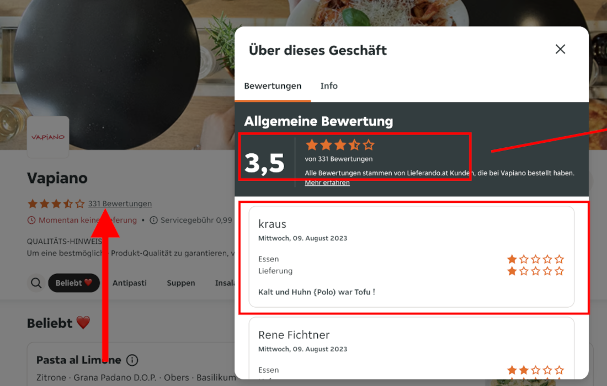
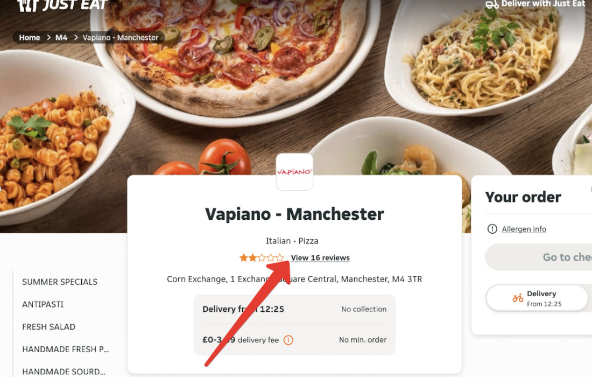
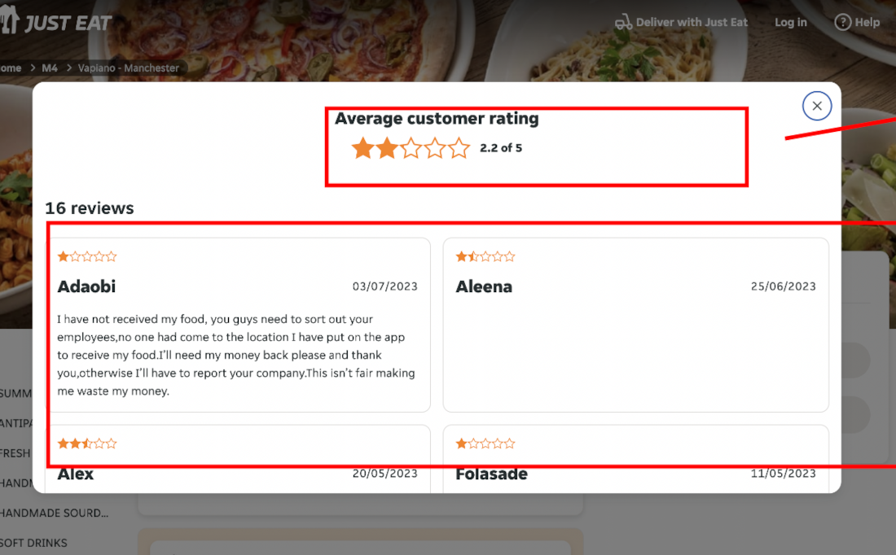

<h1 align="center"> Crawler of cooking sites </h1>

The customer needed to write a crawler to collect ratings and reviews from two types of cooking pages.

## 🚀 Highlights on this project

- Cloudflare bypass protection has been implemented;
- The project uses the Selenium library as well as Undetected_chromedriver;
- The project is dockerized;
- Two types of site layout are crawled;
- Project execution time is 2 days;
- From each page is parsed: the total rating, the number of comments. The author's name, the date of the comment and the text of the comment are parsed from each comment;
- The result is collected in jsonl format (modified json format for line-by-line writing).

## 🚀 Run

To run it is enough to run one command.

```sh
docker-compose up --build
```

The links used for parsing are located in the file `main.py`.

## 🚀 Screenshots






